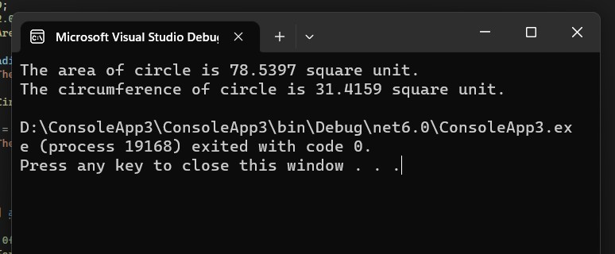

# 8.2 Constant example


## 8.2.1 Local constant (Constant ใน method)

เราสามารถสร้างตัวแปรชนิดคงที่ (Constant) เป็น local variable (สมาชิดของ method) ซึ่งมีชอบเขตการใช้งานภายใน method นั้น ๆ
constant นั้นจะต้องกำหนดค่าเริ่มต้นทันทีที่ประกาศ ไม่สามารถเปลี่ยนแปลงค่าในภายหลังได้

### อธิบายและบันทึกผลการรันโปรแกรมต่อไปนี้ 

```cs
namespace ConstantMemberExample
{
 
    internal class Program
    {
        static void Main(string[] args)
        {
            double radius = 5.0;
            const double PI = 3.14159;
            Console.WriteLine("Welcome, this program calculate circle area");
            Console.Writeline($"The radius of circle is {radius:f} unit.");
            double area = PI * raduis * raduis;
            Console.WritLine($"The area of circle is {area:f4} square unit.");
        }
    }
}
```
อธิบายการทำงาน
```
1. ประกาศตัวแปร radius และกำหนดค่าเริ่มต้นเป็น 5.0
2. ประกาศค่าคงที่ PI และกำหนดค่าเท่ากับ 3.14159
3. แสดงข้อความต้อนรับผู้ใช้งานและแสดงค่า radius ที่ประกาศไว้
4. คำนวณหาพื้นที่วงกลมโดยใช้สูตร PI * r^2 และเก็บผลลัพธ์ในตัวแปร area
5. แสดงผลลัพธ์ของการคำนวณพื้นที่วงกลมที่คำนวณไว้ในตัวแปร area โดยแสดงเป็นทศนิยม 4 ตำแหน่ง
```
ผลการทดลอง


## 8.2.2 Member constant (Constant ของ class)
Member constants มีลักษณะเหมือน local constants ในหัวข้อที่เรียนมาแล้ว  แต่ในกรณีนี้จะเป็นสมาชิกระดับคลาส 
ต้องกำหนดค่าเริ่มต้นทันทีที่ประกาศ ไม่สามารถเปลี่ยนแปลงค่าได้เช่นเดียวกับ local constant
Member constants ต้องระบุในขอบเขตของคลาส และสามารถใช้ได้จากทุก method ในคลาส 
ในภาษา C# จะไม่สามารถประกาศตัวแปรไว้ภายนอกคลาส และไม่สามารถสร้าง global constants ได้

### อธิบายและบันทึกผลการรันโปรแกรมต่อไปนี้ 

```cs
namespace ConstantMemberExample
{
    class MyCircle
    {
        const double PI = 3.14159;
        public static void PrintArea(double radius)
        {
            double area = PI * raduis * radius;
            Console.WriteLine($"The area of circle is {area:f4} square unit.");
        }
    }
    internal class Program
    {
        static void Main(string[] args)
        {
            MyCircle.Printarea(5.0f);
        }
    }
}
```
อธิบายการทำงาน
```
1. คลาส MyCircle เมธอด PrintArea รับพารามิเตอร์ radius นำมาคำนวณหาพื้นที่ของวงกลมด้วยสูตร PI * r * r และพิมพ์ผลลัพธ์ออกทางหน้าจอ
2. ฟังก์ชั่น Main เรียกใช้เมธอด PrintArea ด้วยการส่งค่าพารามิเตอร์ 5.0f แทนค่ารัศมีของวงกลม เพื่อคำนวณพื้นที่ของวงกลมและพิมพ์ผลลัพธ์ออกทางหน้าจอ โดยไม่ต้องใช้ตัวแปร PI เป็นค่าคงที่แล้วในฟังก์ชั่น PrintArea
```
ผลการทดลอง


## 8.2.3 Constant in expression
constant สามารถถูกนำไปใช้ใน expression ได้เช่นเดียวกับ variable ทั่วๆ ไป 
ต่างจาก variable ตรงที่ไม่สามารถเปลี่ยนค่าได้
### อธิบายและบันทึกผลการรันโปรแกรมต่อไปนี้ 
```cs
namespace ConstantMemberExample
{
    class MyCircle
    {
        const double PI = 3.14159;
        const double PI2 = PI*2.0;
        public static void PrintArea(double radius)
        {
            double area = PI * radius * radius;
            Console.WriteLine($"The area of circle is {area:f4} square unit.");
        }
        public static void PrintCircumference(double radius)
        {
            double circumference = PI2 * radius;
            Console.WriteLine($"The circumference of circle is {circumference:f4} square unit.");
        }
    }
    internal class Program
    {
        static void Main(string[] args)
        {
            MyCircle.PrintArea(5.0f);
            MyCircle.PrintCircumference(5.0f);
        }
    }
}
```
อธิบายการทำงาน
```
1. คลาส MyCircle มี static method 2 ตัว คือ PrintArea() และ PrintCircumference() ทั้งสองรับ parameter เป็นค่ารัศมีของวงกลม (radius) และแสดงผลลัพธ์ออกทาง console โดยใช้ค่า PI และ PI2 ที่ประกาศไว้เป็น const member ของคลาส MyCircle
2. ฟังก์ชัน PrintArea() นำค่ารัศมีของวงกลมมาคำนวณหาพื้นที่ของวงกลม แล้วแสดงผลลัพธ์ออกทาง console โดยใช้ format string "The area of circle is {area:f4} square unit." เพื่อแสดงผลลัพธ์ด้วยทศนิยม 4 ตำแหน่ง
3. ฟังก์ชัน PrintCircumference() นำค่ารัศมีของวงกลมมาคำนวณหาเส้นรอบวงของวงกลม แล้วแสดงผลลัพธ์ออกทาง console โดยใช้ format string "The circumference of circle is {circumference:f4} square unit." เพื่อแสดงผลลัพธ์ด้วยทศนิยม 4 ตำแหน่ง
4. ฟังก์ชัน Main() ในคลาส Program เรียกใช้ฟังก์ชัน PrintArea() และ PrintCircumference() ของคลาส MyCircle โดยส่งค่ารัศมีของวงกลมเป็น parameter แต่ละครั้ง ค่ารัศมีที่ใช้ในตัวอย่างนี้เป็น 5.0
```
ผลการทดลอง



## 8.2.4 change value of constant
ถ้าพยายามกำหนดค่าใหม่ให้แก่ constant จะเกิด error ในขั้นตอนการ compile

```cs
namespace ConstantMemberExample
{
    class MyCircle
    {
        const double PI = 3.14159;
        public static void PrintArea(double radius)
        {
            double area = PI * raduis * radius;
            Console.WriteLine($"The area of circle is {area:f4} square unit.");
        }
        PI = Math.PI;  // change value of constant

    }
    internal class Program
    {
        static void Main(string[] args)
        {
            MyCircle.Printarea(5.0f);
        }
    }
}


## 8.2.5 public static constant

เราสามารถกำหนด modifier ของ constant ให้เป็น public ได้  
```cs
namespace ConstantMemberExample
{
    class MyCircle
    {
        public static const double PI = 3.14159;
        public static void PrintArea(double radius)
        {
            double area = PI * radius * raduis;
            Console.WriteLine($"The area of circle is {area:f4} square unit.");
        }
    }
    internal class Program
    {
        static void Main(string[] args)
        {
            MyCircle.Printarea(5.0f);
        }
    }
}
```


## คำถาม

1. Local constants ต่างจาก member constants อย่างไร
```
Local constants
คือค่าคงที่ (constant) ที่ถูกประกาศภายใน method หรือ block ของโปรแกรม ซึ่งมีขอบเขตการใช้งาน (scope) จำกัดอยู่ภายใน method หรือ block นั้น ๆ เท่านั้น ซึ่งสามารถใช้งานได้เฉพาะในส่วนของ method หรือ block นั้น ๆ เท่านั้น และไม่สามารถเข้าถึงได้จากภายนอก block หรือ method นั้น ๆ

member constants
คือค่าคงที่ที่ถูกประกาศภายใน class และมีการใช้งานได้ทั่วทั้ง class ซึ่งสามารถเข้าถึงได้จากภายนอก class ด้วยการเรียกใช้ชื่อ class นั้น ๆ พร้อมกับชื่อของ constant นั้น ๆ ด้วยวิธีการเข้าถึงสมาชิก (member access) ของ class นั้น ๆ โดยใช้ dot notation.
```

2. Local constants สามารถเปลี่ยนค่าภายหลังได้หรือไม่
```
ไม่สามารถเปลี่ยนค่า local constants ได้เนื่องจากเป็นค่าคงที่ (constant) ซึ่งถูกกำหนดค่าตอน compile time และไม่สามารถเปลี่ยนแปลงค่าได้ระหว่างรันโปรแกรม
```
3. Member constants สามารถเปลี่ยนค่าภายหลังได้หรือไม่
```
Member constants ไม่สามารถเปลี่ยนค่าภายหลังได้ เนื่องจากเป็นค่าคงที่ที่ถูกกำหนดไว้แล้วในช่วง compile time และจะไม่สามารถเปลี่ยนค่าได้ใน runtime ดังนั้นถ้าต้องการเปลี่ยนค่า constant จะต้องแก้ไขโค้ดและทำการ compile ใหม่ เพื่อให้ constant มีค่าใหม่ตามที่ต้องการ
```
 