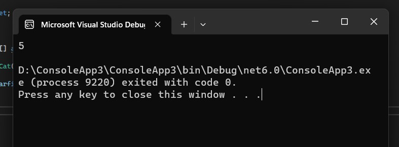

# 8.3 Properties 

Properties เป็นสมาชิกของคลาส ที่ใช้เก็บข้อมูลในลักษณะเดียวกับ fields 

Properties ต้องมี type เสมอ ต้องมี identifier ตามกฎการตั้งชื่อ และต้องเป็นสมาชิกของคลาส ไม่สามารถประกาศไว้นอกคลาสได้	

Properties ต่างจาก field ตรงที่นิยมกำหนดให้เป็น public เพื่อเป็นทางนำข้อมูลเข้าไปยัง field และนำออกจาก field ซึ่งนิยมกำหนดเป็น private

นอกจากนี้เรายังสามารถเพิ่มคำสั่ง (statements) ไว้ภายใน properties ได้ด้วย 

## 8.3.1 การใช้ properties พื้นฐาน 

รันโปรแกรมต่อไปนี้และบันทึกผล

``` cs
namespace PropertyExample
{

    class Cat
    {
        public int Age { get; set; }  // property อย่างง่าย มี getter, setter
    }
    internal class Program
    {
        static void Main(string[] args)
        {
            var Garfield = new Cat();
            Garfield.Age = 5;
            Console.WriteLine(Garfield.Age);
        }
    }
}
```
ผลการรันโปรแกรม


## 8.3.2 เพิ่ม property

รันโปรแกรมต่อไปนี้และบันทึกผล

```cs
namespace PropertyExample
{
    class Cat
    {
        public int Age { get; set; }
        public Color SkinColor { get; set; }

    }
    internal class Program
    {
        static void Main(string[] args)
        {
            var Garfield = new Cat();
            Garfield.Age = 5;
            Garfield.SkinColor = Color.Orange;

            Console.WriteLine(Garfield.Age);
            Console.WriteLine(Garfield.SkinColor);
        }
    }
}
```
ผลการรันโปรแกรม


## 8.3.3  การใช้งาน getter/setter

รันโปรแกรมต่อไปนี้และบันทึกผล

``` cs
namespace PropertyExample
{

    class Cat
    {
        public int Age { get; set; }
        public Color SkinColor { get; set; }

    }
    internal class Program
    {
        static void Main(string[] args)
        {
            var Garfield = new Cat();
            // callint setter
            Garfield.Age.set(5);

            // calling getter
            int catAge = Garfield.Age.get();
            Console.WriteLine(catAge);
        }
    }
}
```
ผลการรันโปรแกรม


## 8.3.4 properties calculation

รันโปรแกรมต่อไปนี้และบันทึกผล
``` cs
namespace PropertyExample
{

    class Cat
    {
        public int Age { get; set; }
        public int YearOfBirth { get; set; }

    }
    internal class Program
    {
        static void Main(string[] args)
        {
            var Garfield = new Cat();
            Garfield.YearOfBirth = 2015;
            int GarAge = 2023 - Garfield.YearOfBirth;
            Console.WriteLine($"Garfield's age = {GarAge}");
        }
    }
}
```
ผลการรันโปรแกรม


## 8.3.5 properties calculation

รันโปรแกรมต่อไปนี้และบันทึกผล

``` cs
namespace PropertyExample
{

    class Cat
    {
        public int Age {
            get { return DateTime.Now.Year - YearOfBirth; }
            set { Age = value; } 
        }
        public int YearOfBirth { get; set; }

    }
    internal class Program
    {
        static void Main(string[] args)
        {
            var Garfield = new Cat();
            Garfield.YearOfBirth = 2015;
            Console.WriteLine($"Garfield's age = {Garfield.Age}");
        }
    }
}
```
ผลการรันโปรแกรม


## 8.3.6 properties calculation

รันโปรแกรมต่อไปนี้และบันทึกผล

```cs
namespace PropertyExample
{

    class Cat
    {
        int age;
        int yearOfBirth;
        public int Age {
            get {  return DateTime.Now.Year - YearOfBirth;  }
            set 
            { 
                age = value;
                yearOfBirth = DateTime.Now.Year - age;
            } 
        }
        public int YearOfBirth {
            get { return yearOfBirth; }
            set { 
                yearOfBirth = value;
                age = DateTime.Now.Year - YearOfBirth;
            }
        }
    }
    internal class Program
    {
        static void Main(string[] args)
        {
            var Garfield = new Cat();
            Garfield.YearOfBirth = 2015;
            Console.WriteLine($"Garfield's age = {Garfield.Age}");
        }
    }
}
```
ผลการรันโปรแกรม


## คำถาม

1. Fields และ properties ต่างกันอย่างไร
```
Fields
คือตัวแปรที่ใช้เก็บข้อมูลภายในคลาส โดยการเข้าถึง Fields จะต้องใช้ชื่อของ Fields โดยตรง ไม่มีการคำนวณหรือประมวลผลเพิ่มเติมใดๆ ดังนั้นการอ่านและการเขียนค่าต้องทำผ่านชื่อ Fields โดยตรง

Properties
คือเมทอดที่ใช้เข้าถึงค่าของตัวแปร โดย Property สามารถทำงานเพิ่มเติมได้ เช่น การตรวจสอบว่าข้อมูลที่ถูกกำหนดให้กับ Properties เป็นข้อมูลที่ถูกต้องหรือไม่ หรือทำการประมวลผลข้อมูลเพิ่มเติมก่อนส่งคืนค่าให้กับ caller
```

2. เมื่อใดควรใช้ field และเมื่อใดควรใช้ properties
```
Fields
ใช้เมื่อต้องการเก็บค่าของตัวแปรหรือข้อมูลของ object โดยตรง โดยไม่ต้องการการเข้าถึงหรือตรวจสอบอื่นๆ ก่อน โดยที่ไม่ต้องมีการตรวจสอบความถูกต้องของค่านั้นๆ

Properties
ใช้เมื่อต้องการเข้าถึงหรือตั้งค่าค่าของตัวแปรหรือข้อมูลของ object โดยต้องมีการตรวจสอบความถูกต้องของค่านั้นๆ ก่อน รวมถึงสามารถทำการคำนวณค่าอื่นๆ ก่อนที่จะคืนค่าหรือตั้งค่าค่าให้กับตัวแปรหรือข้อมูลนั้นๆ ได้
```

3. value ใน setter หมายถึงอะไร
```
เป็น method ที่ใช้ในการกำหนดค่าของ property ดังนั้นเมื่อมีการ set ค่าให้กับ property จะมีการส่งค่าที่ต้องการ set เข้ามาผ่าน parameter ของ setter method นั้น
```
4. return ใน setter ต้องมี type ตรงกับอะไร
```
จะต้องมี type เป็น void ซึ่งแสดงว่าไม่มีการส่งค่ากลับมาจาก setter โดยทั่วไป setter จะใช้สำหรับการ set ค่าของ property โดยตรง และไม่มีการ return ค่าใดๆ กลับไปยัง caller ของ setter
```