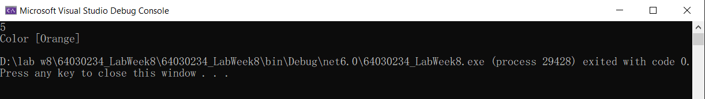

# 8.3 Properties 

Properties เป็นสมาชิกของคลาส ที่ใช้เก็บข้อมูลในลักษณะเดียวกับ fields 

Properties ต้องมี type เสมอ ต้องมี identifier ตามกฎการตั้งชื่อ และต้องเป็นสมาชิกของคลาส ไม่สามารถประกาศไว้นอกคลาสได้	

Properties ต่างจาก field ตรงที่นิยมกำหนดให้เป็น public เพื่อเป็นทางนำข้อมูลเข้าไปยัง field และนำออกจาก field ซึ่งนิยมกำหนดเป็น private

นอกจากนี้เรายังสามารถเพิ่มคำสั่ง (statements) ไว้ภายใน properties ได้ด้วย 

## 8.3.1 การใช้ properties พื้นฐาน 

รันโปรแกรมต่อไปนี้และบันทึกผล

``` cs
namespace PropertyExample
{

    class Cat
    {
        public int Age { get; set; }  // property อย่างง่าย มี getter, setter
    }
    internal class Program
    {
        static void Main(string[] args)
        {
            var Garfield = new Cat();
            Garfield.Age = 5;
            Console.WriteLine(Garfield.Age);
        }
    }
}
```
### ผลลัพธ์

## 8.3.2 เพิ่ม property

รันโปรแกรมต่อไปนี้และบันทึกผล

```cs
namespace PropertyExample
{
    class Cat
    {
        public int Age { get; set; }
        public Color SkinColor { get; set; }

    }
    internal class Program
    {
        static void Main(string[] args)
        {
            var Garfield = new Cat();
            Garfield.Age = 5;
            Garfield.SkinColor = Color.Orange;

            Console.WriteLine(Garfield.Age);
            Console.WriteLine(Garfield.SkinColor);
        }
    }
}
```
### แก้ไข Code


### ผลลัพธ์




## 8.3.3  การใช้งาน getter/setter

รันโปรแกรมต่อไปนี้และบันทึกผล

``` cs
namespace PropertyExample
{

    class Cat
    {
        public int Age { get; set; }
        public Color SkinColor { get; set; }

    }
    internal class Program
    {
        static void Main(string[] args)
        {
            var Garfield = new Cat();
            // callint setter
            Garfield.Age.set(5);

            // calling getter
            int catAge = Garfield.Age.get();
            Console.WriteLine(catAge);
        }
    }
}
```
### ผลลัพธ์

Error เพราะ ไม่สามารถเรียกใช้ get และ set ในฐานะ method ได้ สามรถเรียกใช้ได้ เช่น 

Garfield.Age = 5;

int catAge = Garfield.Age;


### แก้ไข Code


### ผลลัพธ์


## 8.3.4 properties calculation

รันโปรแกรมต่อไปนี้และบันทึกผล
``` cs
namespace PropertyExample
{

    class Cat
    {
        public int Age { get; set; }
        public int YearOfBirth { get; set; }

    }
    internal class Program
    {
        static void Main(string[] args)
        {
            var Garfield = new Cat();
            Garfield.YearOfBirth = 2015;
            int GarAge = 2023 - Garfield.YearOfBirth;
            Console.WriteLine($"Garfield's age = {GarAge}");
        }
    }
}
```
### ผลลัพธ์


## 8.3.5 properties calculation

รันโปรแกรมต่อไปนี้และบันทึกผล

``` cs
namespace PropertyExample
{

    class Cat
    {
        public int Age {
            get { return DateTime.Now.Year - YearOfBirth; }
            set { Age = value; } 
        }
        public int YearOfBirth { get; set; }

    }
    internal class Program
    {
        static void Main(string[] args)
        {
            var Garfield = new Cat();
            Garfield.YearOfBirth = 2015;
            Console.WriteLine($"Garfield's age = {Garfield.Age}");
        }
    }
}
```
### ผลลัพธ์


## 8.3.6 properties calculation

รันโปรแกรมต่อไปนี้และบันทึกผล

```cs
namespace PropertyExample
{

    class Cat
    {
        int age;
        int yearOfBirth;
        public int Age {
            get {  return DateTime.Now.Year - YearOfBirth;  }
            set 
            { 
                age = value;
                yearOfBirth = DateTime.Now.Year - age;
            } 
        }
        public int YearOfBirth {
            get { return yearOfBirth; }
            set { 
                yearOfBirth = value;
                age = DateTime.Now.Year - YearOfBirth;
            }
        }
    }
    internal class Program
    {
        static void Main(string[] args)
        {
            var Garfield = new Cat();
            Garfield.YearOfBirth = 2015;
            Console.WriteLine($"Garfield's age = {Garfield.Age}");
        }
    }
}
```
### ผลลัพธ์


## คำถาม

1. Fields และ properties ต่างกันอย่างไร
> ตอบ  

- Field คือ ตัวแปรที่สามารถเปลี่ยนแปลค่าได้ซึ่งถูกประกาศในคลาสเพื่อเก็บข้อมูล
properties คือ วิธีการเข้าถึงและกำหนดค่าของตัวแปรภายในคลาสโดยไม่ต้องเขียน method โดยตะใช้ท method getter and setter 

2. เมื่อใดควรใช้ field และเมื่อใดควรใช้ properties
> ตอบ

- Field ใช้ตอนที่ต้องการเก็บข้อมูลโดยตรงที่ไม่ต้องการการเข้าถึงและไม่ต้องการการตรวจสอบความถูกต้องของข้อมูล
properties ใช้ตอนที่ต้องการเข้าถึงหรือตั้งค่าตัวแปรโดยต้อบงการให้มีการตรวจสอบความถูกต้องของข้อมูลที่รับเข้ามา และใช้ในตอนที่ต้องการคำนวณค่าข้อมูลเพื่อเก็บลงในคัวแปรโดยที่ไม่ต้องเขียน method เพื่อคำนวณค่า

3. value ใน setter หมายถึงอะไร
> ตอบ

- ตัวแปรพิเศษของ property ที่ใช้สำหรับเป็นตัวแทนของข้อมูลที่กำลังจะ set ให้กับ properties โดยข้อมูลที่จะ set ให้ properties จะถูกเก็บไว้ที่ value ก่อนนั่นเอง

4. return ใน setter ต้องมี type ตรงกับอะไร
> ตอบ

- ต้องมี type เป็นชนิดเดียวกับ properties