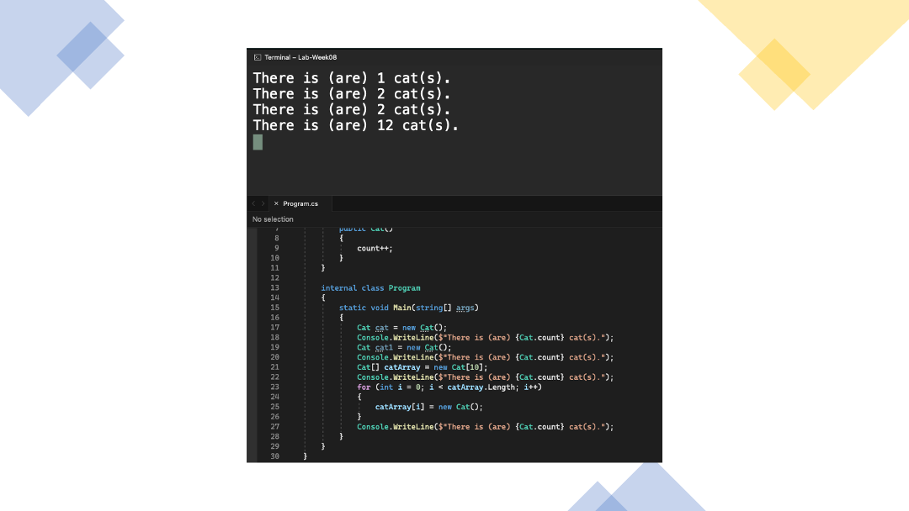
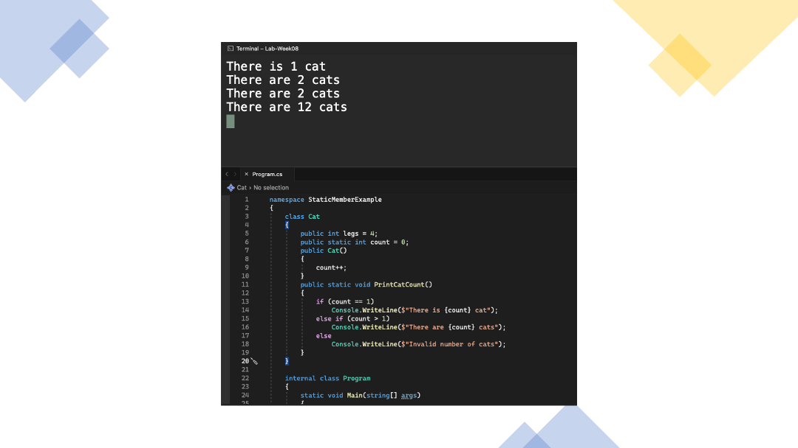
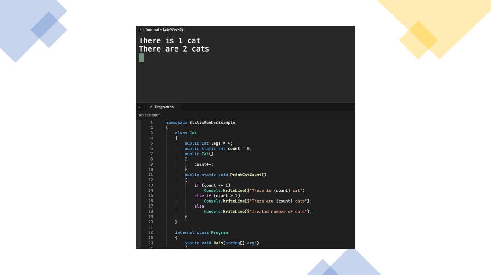

# 8.1 Static members

Member ของ class นั้น สามารถเป็นได้ทั้งแบบ instance member และ static member 

โดยที่ instance member จะถูกสร้างขึ้นใหม่ทุกครั้งเมื่อสร้าง instance ด้วยคำสั่ง new การเปลี่ยนแปลงค่าใด ๆ ใน instance member หนึ่ง ๆ จะไม่กระทบต่อ member ใน instance อื่นที่สร้างจากคลาสเดียวกัน 

ในขณะที่ static member จะถูกสร้างเพียงครั้งเดียว และไม่ต้องใช้คำสั่ง new 
ทุก instance ที่สร้างจากคลาสเดียวกันจะใช้ static member ร่วมกัน การเปลี่ยนค่าของ static member จะส่งผลต่อทุก instance ที่สร้างจากคลาสนั้น


## 8.1.1 ให้อธิบายการทำงานของโปรแกรมต่อไปนี้ พร้อมทั้งบันทึกผลการทดลอง
```cs
namespace StaticMemberExample
{
    class Cat
    {
        public int legs = 4;
    }

    class Duck
    {
        public static int legs = 2;
    }

    internal class Program
    {
        static void Main(string[] args)
        {
            Cat cat = new Cat();
            Console.WriteLine($"Cat has  {cat.legs} legs.");   // instance member
            Console.WriteLine($"Duck has  {Duck.legs} legs");  // static member
        }
    }
}

```
* ในคลาส Cat มีตัวแปร legs ที่เป็นตัวแปร instance หมายความว่าแต่ละ object ที่สร้างจากคลาส Cat จะมีตัวแปร legs ของตัวเองแยกกันอยู่
* ในคลาส Duck มีตัวแปร legs ที่เป็นตัวแปร static หมายความว่ามันจะถูกแชร์ร่วมกันทั้งหมดของ object ที่สร้างจากคลาส Duck ทั้งหมด ซึ่งจะไม่เกี่ยวข้องกับการสร้าง object เลย
* ในฟังก์ชัน Main โปรแกรมสร้าง object ของคลาส Cat และ Duck จากนั้นแสดงผลลัพธ์เป็นจำนวนขาของแต่ละ object โดยใช้ตัวแปร legs ที่อยู่ใน Cat และ Duck ตามลำดับ <br>


## 8.1.2 ให้อธิบายการทำงานของโปรแกรมต่อไปนี้ พร้อมทั้งบันทึกผลการทดลอง
```cs
namespace StaticMemberExample
{
    class Cat
    {
        public int legs = 4;
        public static int count = 0;
        public Cat()
        {
            count++;
        }
    }

    internal class Program
    {
        static void Main(string[] args)
        {
            Cat cat = new Cat();
            Console.WriteLine($"There is (are) {Cat.count} cat(s).");
            Cat cat1 = new Cat();
            Console.WriteLine($"There is (are) {Cat.count} cat(s).");
            Cat[] catArray = new Cat[10];
            Console.WriteLine($"There is (are) {Cat.count} cat(s).");
            for (int i = 0; i < catArray.Length; i++)
            {
                catArray[i] = new Cat();
            }
            Console.WriteLine($"There is (are) {Cat.count} cat(s).");
        }
    }
}

```
* ในคลาส Cat มีตัวแปร legs ที่เป็นตัวแปร instance และ count เป็นตัวแปร static ซึ่งจะถูกนับจำนวน object ที่สร้างจากคลาส Cat ทั้งหมด
* ใน constructor ของ Cat จะเพิ่มค่า count ทุกครั้งที่สร้าง object ใหม่
* ในฟังก์ชัน Main โปรแกรมสร้าง object ของคลาส Cat และแสดงผลลัพธ์จำนวนของ object แต่ละครั้งโดยใช้ตัวแปร count ที่อยู่ใน Cat โดยก่อนจะสร้าง array of Cat ต้องเรียกใช้งาน Cat.count อย่างน้อย 2 ครั้งเนื่องจาก count เป็นตัวแปร static และจะไม่มีการกำหนดค่าเริ่มต้นในการสร้าง object แรก
* ค่า count เพิ่มขึ้นตามจำนวน object ที่สร้างขึ้นในตอนท้ายของโปรแกรมเป็น 10 ตัว และรวมกับ object ที่สร้างก่อนหน้านี้ทำให้มีจำนวน object ทั้งหมดเป็น 13 ตัว<br>

## 8.1.3 ให้อธิบายการทำงานของโปรแกรมต่อไปนี้ พร้อมทั้งบันทึกผลการทดลอง

```cs
namespace StaticMemberExample
{
    class Cat
    {
        public int legs = 4;
        public static int count = 0;
        public Cat()
        {
            count++;
        }
        public static void PrintCatCount()
        {
            if (count == 1)
                Console.WriteLine($"There is {count} cat");
            else if (count > 1)
                Console.WriteLine($"There are {count} cats");
            else
                Console.WriteLine($"Invalid number of cats");
        }
    }

    internal class Program
    {
        static void Main(string[] args)
        {
            Cat cat = new Cat();
            Cat.PrintCatCount();
            Cat cat1 = new Cat();
            Cat.PrintCatCount();
            Cat[] catArray = new Cat[10];
            Cat.PrintCatCount();
            for (int i = 0; i < catArray.Length; i++)
            {
                catArray[i] = new Cat();
            }
            Cat.PrintCatCount();
        }
    }
}
```
* โปรแกรมนี้เป็นโปรแกรมที่ใช้สำหรับนับจำนวนแมวที่ถูกสร้างขึ้นโดยใช้คลาส Cat โดยมี static member ชื่อ count เพื่อนับจำนวนแมวที่ถูกสร้างขึ้น และมี static method ชื่อ PrintCatCount ซึ่งใช้สำหรับพิมพ์จำนวนแมวที่ถูกสร้างขึ้นไปแล้ว โดยจะตรวจสอบค่า count ว่ามีค่าเป็นเลขกี่ และพิมพ์ผลลัพธ์ออกมาตามเงื่อนไขที่กำหนดในเมธอด PrintCatCount
* ใน Main method จะสร้างแมวขึ้นมา 3 ตัวและพิมพ์จำนวนแมวที่ถูกสร้างขึ้นไปแล้ว หลังจากนั้นจึงสร้างอีก 10 ตัวแมวขึ้นมา และพิมพ์จำนวนแมวทั้งหมดออกมาอีกครั้ง ผลลัพธ์ที่แสดงจะเป็นจำนวนแมวที่ถูกสร้างขึ้นมาในแต่ละขั้นตอนของโปรแกรม โดยจะเพิ่มขึ้นตามจำนวนการสร้างแมวที่เกิดขึ้นในแต่ละขั้นตอน ซึ่งแสดงผลลัพธ์เป็น "There is (are) x cat(s)." โดย x คือจำนวนแมวที่ถูกสร้างขึ้นโดยใช้คลาส Cat ในแต่ละขั้นตอนของโปรแกรม. ต่อมาก็จะมีการเรียกใช้ static method PrintCatCount เพื่อพิมพ์จำนวนแมวทั้งหมดในแต่ละขั้นตอนของโปรแกรมอีกครั้ง. <br>

## 8.1.4 ให้อธิบายการทำงานของโปรแกรมต่อไปนี้ พร้อมทั้งบันทึกผลการทดลอง

```cs
namespace StaticMemberExample
{
    class Cat
    {
        public int legs = 4;
        public static int count = 0;
        public Cat()
        {
            count++;
        }
        public static void PrintCatCount()
        {
            if (count == 1)
                Console.WriteLine($"There is {count} cat");
            else if (count > 1)
                Console.WriteLine($"There are {count} cats");
            else
                Console.WriteLine($"Invalid number of cats");
        }
    }

    internal class Program
    {
        static void Main(string[] args)
        {
            Cat cat = new Cat();
            Cat.PrintCatCount();
            Cat cat1 = new Cat();
            cat1.PrintCatCount();
        }
    }
}
```
* สร้างคลาส Cat ซึ่งประกอบไปด้วยสมาชิก legs ที่เป็นตัวแปร instance และ count ที่เป็นตัวแปร static และเมท็อด PrintCatCount() ที่ใช้สำหรับพิมพ์จำนวนแมวที่ถูกสร้างขึ้นมา ในเมท็อด Cat() ก็มีการเพิ่มค่าตัวแปร count เมื่อมีการสร้าง object ใหม่
* ใน Main() ก็มีการสร้าง object cat และ cat1 ของคลาส Cat ตามลำดับ และใช้เมท็อด PrintCatCount() ในการพิมพ์จำนวนแมวที่ถูกสร้างขึ้น โดยใช้ Cat.PrintCatCount() เพื่อพิมพ์จำนวนแมวทั้งหมด เมื่อพิมพ์เสร็จจะได้ผลลัพธ์ออกมาว่า "There is 1 cat" เพราะว่าในขณะนี้มีแค่ object cat เท่านั้น จากนั้นจึงสร้าง object cat1 ต่อ และใช้ Cat.PrintCatCount() อีกครั้ง ซึ่งจะได้ผลลัพธ์ออกมาว่า "There are 2 cats" เนื่องจากว่ามีแมว 2 ตัวแล้ว <br>


## คำถาม

1. Static member ต่างจาก instance member  อย่างไร
* Static member จะถูกแชร์ร่วมกันในทุก instance ของคลาสเดียวกัน ในขณะที่ instance member จะมีค่าที่แตกต่างกันในแต่ละ instance ของคลาสเดียวกัน
2. สถานการณ์ใดที่ควรใช้ static member
* การใช้ static member เหมาะสมในสถานการณ์ที่ต้องการเก็บค่าหรือฟังก์ชันของคลาสที่ไม่ต้องการสร้างอ็อบเจกต์เพื่อเข้าถึง หรือในกรณีที่ต้องการแชร์ค่าของตัวแปรระหว่างอ็อบเจกต์ทั้งหมดของคลาส และใช้ค่าคงที่ที่ไม่มีการเปลี่ยนแปลงระหว่างการทำงานของโปรแกรม เช่น ค่า Pi ในคลาส Math ของภาษา Java หรือ C#

