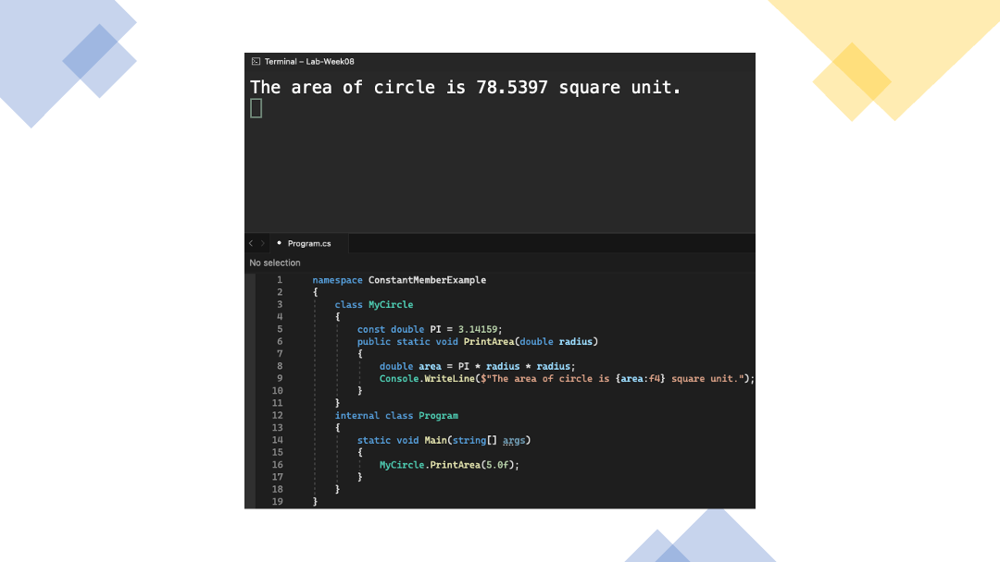
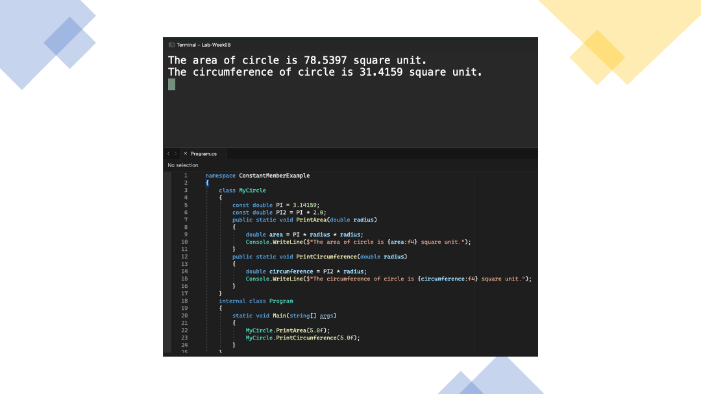

# 8.2 Constant example


## 8.2.1 Local constant (Constant ใน method)

เราสามารถสร้างตัวแปรชนิดคงที่ (Constant) เป็น local variable (สมาชิดของ method) ซึ่งมีชอบเขตการใช้งานภายใน method นั้น ๆ
constant นั้นจะต้องกำหนดค่าเริ่มต้นทันทีที่ประกาศ ไม่สามารถเปลี่ยนแปลงค่าในภายหลังได้

### อธิบายและบันทึกผลการรันโปรแกรมต่อไปนี้ 

```cs
namespace ConstantMemberExample
{
 
    internal class Program
    {
        static void Main(string[] args)
        {
            double radius = 5.0;
            const double PI = 3.14159;
            Console.WriteLine("Welcome, this program calculate circle area");
            Console.Writeline($"The radius of circle is {radius:f} unit.");
            double area = PI * raduis * raduis;
            Console.WritLine($"The area of circle is {area:f4} square unit.");
        }
    }
}
```
* เป็นโปรแกรมที่ใช้ค่าคงที่ (constant) เพื่อกำหนดค่า PI เป็นค่าคงที่ แล้วใช้ในการคำนวณพื้นที่ของวงกลม โดยรับค่ารัศมีจากผู้ใช้งานผ่านพารามิเตอร์แล้วคำนวณและแสดงผลพื้นที่ของวงกลมในรูปแบบทศนิยม 4 ตำแหน่งด้วยเมธอด WriteLine() ของคลาส Console ซึ่งเป็น static method ด้วยกัน <br>


## 8.2.2 Member constant (Constant ของ class)
Member constants มีลักษณะเหมือน local constants ในหัวข้อที่เรียนมาแล้ว  แต่ในกรณีนี้จะเป็นสมาชิกระดับคลาส 
ต้องกำหนดค่าเริ่มต้นทันทีที่ประกาศ ไม่สามารถเปลี่ยนแปลงค่าได้เช่นเดียวกับ local constant
Member constants ต้องระบุในขอบเขตของคลาส และสามารถใช้ได้จากทุก method ในคลาส 
ในภาษา C# จะไม่สามารถประกาศตัวแปรไว้ภายนอกคลาส และไม่สามารถสร้าง global constants ได้

### อธิบายและบันทึกผลการรันโปรแกรมต่อไปนี้ 

```cs
namespace ConstantMemberExample
{
    class MyCircle
    {
        const double PI = 3.14159;
        public static void PrintArea(double radius)
        {
            double area = PI * raduis * radius;
            Console.WriteLine($"The area of circle is {area:f4} square unit.");
        }
    }
    internal class Program
    {
        static void Main(string[] args)
        {
            MyCircle.Printarea(5.0f);
        }
    }
}
```

* โปรแกรมนี้เป็นโปรแกรมที่ใช้ค่าคงที่ (constant member) เพื่อคำนวณหาพื้นที่ของวงกลม โดยในคลาส MyCircle มีค่าคงที่ PI ที่กำหนดไว้เป็น 3.14159 และมีเมธอด PrintArea ที่รับพารามิเตอร์เป็นรัศมีของวงกลม โดยใช้ค่าคงที่ PI ในการคำนวณหาพื้นที่ ส่วนใน Main method จะเรียกใช้เมธอด PrintArea ของคลาส MyCircle โดยส่งพารามิเตอร์เป็นค่ารัศมี 5.0f และแสดงผลลัพธ์ของการคำนวณพื้นที่ของวงกลมผ่าน Console <br>


## 8.2.3 Constant in expression
constant สามารถถูกนำไปใช้ใน expression ได้เช่นเดียวกับ variable ทั่วๆ ไป 
ต่างจาก variable ตรงที่ไม่สามารถเปลี่ยนค่าได้
### อธิบายและบันทึกผลการรันโปรแกรมต่อไปนี้ 
```cs
namespace ConstantMemberExample
{
    class MyCircle
    {
        const double PI = 3.14159;
        const double PI2 = PI*2.0;
        public static void PrintArea(double radius)
        {
            double area = PI * radius * radius;
            Console.WriteLine($"The area of circle is {area:f4} square unit.");
        }
        public static void PrintCircumference(double radius)
        {
            double circumference = PI2 * radius;
            Console.WriteLine($"The circumference of circle is {circumference:f4} square unit.");
        }
    }
    internal class Program
    {
        static void Main(string[] args)
        {
            MyCircle.PrintArea(5.0f);
            MyCircle.PrintCircumference(5.0f);
        }
    }
}
```

* โปรแกรมด้านบนเป็นตัวอย่างการใช้ค่าคงที่ (constant) ในคลาส MyCircle เพื่อคำนวณพื้นที่และเส้นรอบวงของวงกลม โดยมี PI และ PI2 เป็นค่าคงที่ที่ไม่สามารถเปลี่ยนแปลงได้ เมื่อเรียกใช้งาน MyCircle.PrintArea(5.0f) จะคำนวณพื้นที่ของวงกลมที่มีรัศมี 5.0 หน่วย และแสดงผลลัพธ์ด้วย Console.WriteLine() ในที่นี้จะแสดงข้อความว่า "The area of circle is [ผลลัพธ์] square unit." เมื่อเรียกใช้งาน MyCircle.PrintCircumference(5.0f) จะคำนวณความยาวเส้นรอบวงของวงกลมที่มีรัศมี 5.0 หน่วย และแสดงผลลัพธ์ด้วย Console.WriteLine() ในที่นี้จะแสดงข้อความว่า "The circumference of circle is [ผลลัพธ์] square unit." <br>

## 8.2.4 change value of constant
ถ้าพยายามกำหนดค่าใหม่ให้แก่ constant จะเกิด error ในขั้นตอนการ compile

```cs
namespace ConstantMemberExample
{
    class MyCircle
    {
        const double PI = 3.14159;
        public static void PrintArea(double radius)
        {
            double area = PI * raduis * radius;
            Console.WriteLine($"The area of circle is {area:f4} square unit.");
        }
        PI = Math.PI;  // change value of constant

    }
    internal class Program
    {
        static void Main(string[] args)
        {
            MyCircle.Printarea(5.0f);
        }
    }
}
```
* โปรแกรมนี้เป็นตัวอย่างการใช้ค่าคงที่ (constant) ในภาษา C# โดยใช้ตัวอย่างของการคำนวณพื้นที่วงกลม โดยกำหนดค่า PI ให้เป็นค่าคงที่ 3.14159 ดังนั้นสามารถเรียกใช้เมธอด PrintArea ของคลาส MyCircle และส่งค่ารัศมีของวงกลมไปในพารามิเตอร์ จากนั้นโปรแกรมจะคำนวณพื้นที่ของวงกลมด้วยสูตร PI * r * r แล้วแสดงผลลัพธ์ออกทางหน้าจอ
ในการแก้ไขโค้ดที่กำหนดค่าคงที่ PI ให้ใช้คำสำคัญ public const double PI = 3.14159; เนื่องจากตัวแปรค่าคงที่ต้องกำหนดค่าแล้วไม่สามารถเปลี่ยนแปลงค่าได้หลังจากกำหนดค่าแล้ว ในที่นี้กำหนดให้ PI เป็น public เพื่อให้สามารถเรียกใช้ค่าคงที่นี้ได้จากทุกที่ในโปรแกรมและเป็น const เพื่อให้เวลาเรียกใช้ PI แล้วสามารถใช้ค่า PI นี้ได้ตลอดการทำงานของโปรแกรมโดยไม่มีการเปลี่ยนแปลงค่า PI อีกครั้ง ในท้ายที่สุดโปรแกรมจะแสดงผลลัพธ์การคำนวณพื้นที่ของวงกลมออกทางหน้าจอด้วยค่า PI ที่กำหนดไว้แล้ว ซึ่งจะเป็นค่าคงที่ตลอดระยะเวลาในการทำงานของโปรแกรม <br>


## 8.2.5 public static constant

เราสามารถกำหนด modifier ของ constant ให้เป็น public ได้  
```cs
namespace ConstantMemberExample
{
    class MyCircle
    {
        public static const double PI = 3.14159;
        public static void PrintArea(double radius)
        {
            double area = PI * radius * raduis;
            Console.WriteLine($"The area of circle is {area:f4} square unit.");
        }
    }
    internal class Program
    {
        static void Main(string[] args)
        {
            MyCircle.Printarea(5.0f);
        }
    }
}
```
* โค้ดดั้งเดิมมี syntax error เนื่องจากต้องประกาศค่าคงที่ของ static member ด้วยคีย์เวิร์ด readonly แทนการใช้ const ซึ่งต่างกันตรงที่ const จะต้องกำหนดค่าไว้ตอน compile time และไม่สามารถเปลี่ยนแปลงค่าได้ ในขณะที่ readonly สามารถกำหนดค่าได้ตอน runtime แต่หลังจากกำหนดค่าแล้วจะไม่สามารถเปลี่ยนแปลงค่าได้อีก <br>


## คำถาม

1. Local constants ต่างจาก member constants อย่างไร
* Local constants คือ constants ที่ถูกประกาศภายใน scope ของ method หรือ block statement ที่เฉพาะเจาะจง ซึ่งมีขอบเขตในการใช้งานเฉพาะในส่วนนั้น ส่วน member constants เป็น constants ที่ถูกประกาศภายใน class และสามารถเข้าถึงได้จากทุกส่วนของ class และอาจถูกเรียกใช้ได้จาก code ภายนอก class ด้วยการเรียกผ่านชื่อ class และชื่อ constant นั้นๆ
2. Local constants สามารถเปลี่ยนค่าภายหลังได้หรือไม่
* ไม่ได้ ค่าของ local constant ถูกกำหนดค่าคงที่ตอน compile time และไม่สามารถเปลี่ยนแปลงได้ในระหว่าง runtime ของโปรแกรม ถ้าต้องการเปลี่ยนค่าต้องใช้ตัวแปรปกติแทน
3. Member constants สามารถเปลี่ยนค่าภายหลังได้หรือไม่
* ไม่ได้ เพราะว่า member constants เป็นค่าคงที่ที่กำหนดไว้ในระหว่างการประกาศ class และไม่สามารถเปลี่ยนแปลงค่าได้ในภายหลัง ถ้าต้องการเปลี่ยนค่าต้องแก้ไขค่าคงที่ใน source code แล้วคอมไพล์ใหม่
 